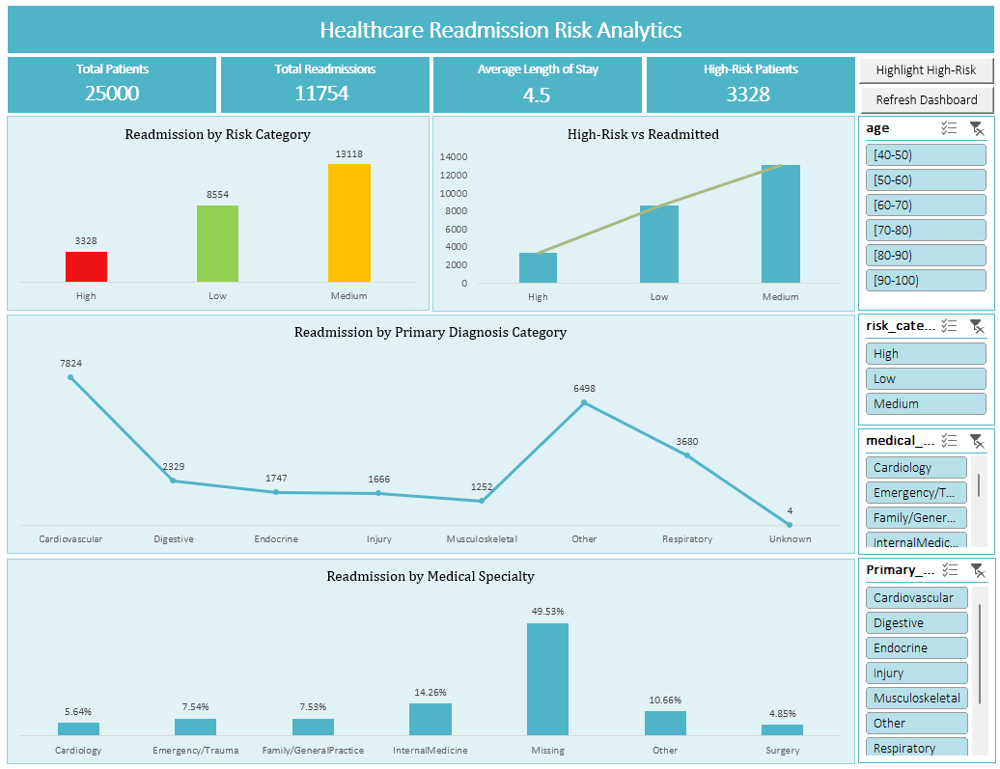

# 🏥 Healthcare Readmission Risk Analytics
Macro-Based Advanced Excel Dashboard | Healthcare • Readmissions • Risk Analysis

## 📌 Overview
A **macro-driven Advanced Excel dashboard** built on **25,000 patient records** to analyze **hospital readmissions, patient risk categories, length of stay, and diagnosis trends**.

The dashboard uses **Excel VBA macros** to enable interactive filtering, highlighting of high-risk patients, and real-time KPI refresh for fast, decision-ready insights.

---

## 🎯 Business Objective
- Track hospital readmission performance
- Identify **high-risk patient segments**
- Analyze readmissions by **risk level, age group, diagnosis, and specialty**
- Support data-driven discharge planning and care prioritization

---

## ⭐ STAR Method Breakdown

### **S — Situation**
Healthcare teams lacked a fast and interactive system to:
- Identify **high-risk patients prone to readmission**
- Analyze readmissions across risk levels, age groups, and diagnoses
- Manually track KPIs across large patient datasets

### **T — Task**
Design a **single-page, macro-enabled Excel dashboard** that:
- Tracks core readmission KPIs
- Segments patients by **risk category and age group**
- Highlights **high-risk patients automatically**
- Allows one-click dashboard refresh using VBA

### **A — Action**
- Cleaned and structured **25,000 healthcare records** in Excel
- Built KPI cards for:
  - Total Patients
  - Total Readmissions
  - Average Length of Stay
  - High-Risk Patient Count
- Developed **VBA macros** to:
  - Refresh dashboard data dynamically
  - Highlight high-risk patients using conditional logic
  - Enable button-based interactions (Refresh / High-Risk Highlight)
- Designed Pivot Tables & Pivot Charts for:
  - Readmissions by Risk Category
  - High-Risk vs Readmitted comparison
  - Readmissions by Primary Diagnosis
  - Readmissions by Medical Specialty
- Implemented slicers for **age group, risk level, diagnosis, and specialty**

### **R — Result**
- Analyzed **25,000 patients** with **11,754 readmissions**
- Identified **3,328 high-risk patients** for targeted care planning
- Determined an **average length of stay of 4.5 days**
- Revealed **Medium-risk patients** as the largest contributor to readmissions (**13,118 cases**)
- Enabled faster decision-making through **one-click macro refresh and risk highlighting**

---

## 📊 Key Metrics (KPIs)
- **Total Patients:** 25,000  
- **Total Readmissions:** 11,754  
- **Average Length of Stay:** 4.5 days  
- **High-Risk Patients:** 3,328  

---

## 📊 Dashboard Page

### Healthcare Readmission Risk Dashboard
- This is a macro‑enabled advanced Excel single‑page dashboard designed to provide interactive, executive‑level insights into healthcare readmission risk across patients, diagnoses, and medical specialties.

---

## 🔍 Key Insights
- **Medium-risk patients** account for the highest readmissions (**13,118 cases**)
- **High-risk patients (3,328)** represent a critical intervention group
- **Cardiovascular cases** contribute the most readmissions (**7,824**)
- Majority of readmissions occur in the **50–80 age group**
- Missing medical specialty data (**49.53%**) highlights data quality improvement opportunities

---

## 💼 Business Use Cases
- Faster identification of high-risk readmission cases
- Reduced manual reporting effort using VBA automation
- Improved visibility into diagnosis-driven readmission trends
- Supports hospital readmission reduction initiatives

---

## 📊 Tools & Technologies
- **Microsoft Excel (Advanced)**
- **VBA / Macros**
- Pivot Tables & Pivot Charts
- Advanced Excel formulas
- Slicers & conditional formatting
- Data validation & cleansing

---

## 🧩 Project Context
This project demonstrates **advanced Excel analytics skills**, combining **VBA automation and dashboard design** to deliver business-ready healthcare insights.

---

## 👤 Author
**Shadan Tech**   
_Data Analyst_

🔗 [LinkedIn Profile](https://www.linkedin.com/in/shadansarfaraz1)  
🔗 [Tableau Public Profile](https://public.tableau.com/app/profile/shadansarfaraz/vizzes)
🔗 [Newsletter](https://shadansarfaraz.substack.com/)

---

## ⭐ Show Your Support
If you found this project insightful, give it a **⭐ Star** on GitHub — it helps others discover it too!  
Connect on **LinkedIn** for more Power BI, Tableau, and Data Analytics projects.